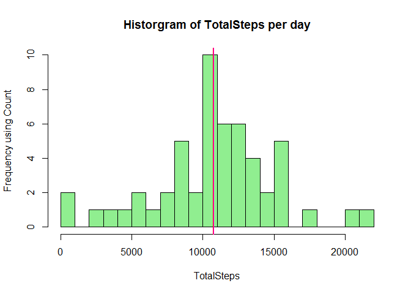
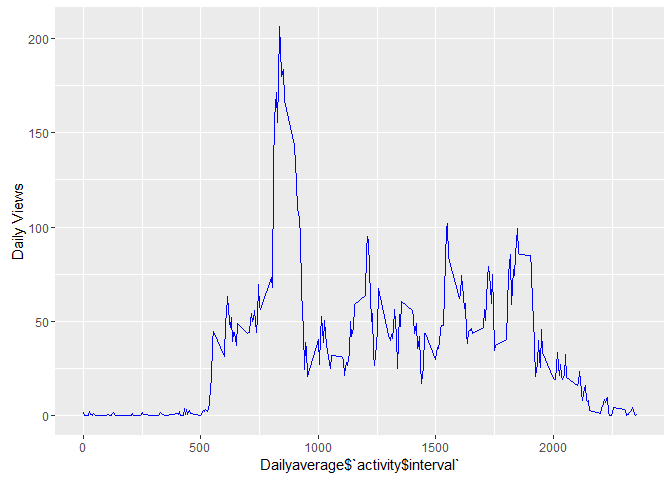
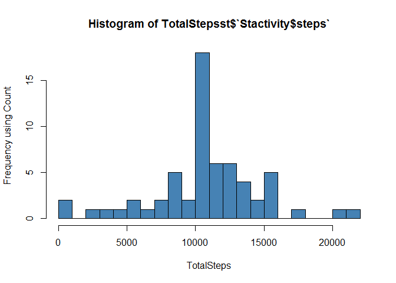
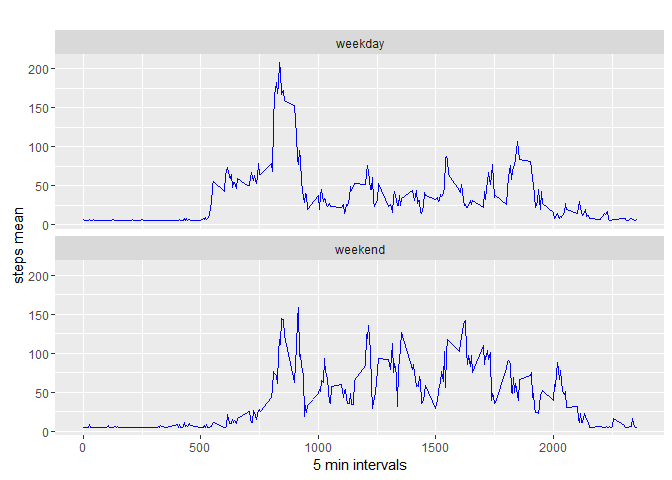

# Reproducible Research: Peer Assessment 1


## Loading and preprocessing the data

```r
library(ggplot2)
library(Hmisc)
```

```
## Loading required package: lattice
```

```
## Loading required package: survival
```

```
## Loading required package: Formula
```

```
## 
## Attaching package: 'Hmisc'
```

```
## The following objects are masked from 'package:base':
## 
##     format.pval, round.POSIXt, trunc.POSIXt, units
```

```r
# Set the working directory for the Project
setwd ("C://DataSceince//Reproduceable_research//Reproduceable-Research-CourseProject1//data//RepData_PeerAssessment1")
#Download the file from the file location
if(!file.exists("./data")){dir.create("./data")}
fileUrl <- "https://d396qusza40orc.cloudfront.net/repdata%2Fdata%2Factivity.zip"
download.file(fileUrl,destfile="./data/activity.zip")
#unZip the file for data
unzip(zipfile="./data/activity.zip",exdir="./data")


activity<- read.csv(".//data//activity.csv",header = TRUE,sep = ",")
head(activity)
```

```
##   steps       date interval
## 1    NA 2012-10-01        0
## 2    NA 2012-10-01        5
## 3    NA 2012-10-01       10
## 4    NA 2012-10-01       15
## 5    NA 2012-10-01       20
## 6    NA 2012-10-01       25
```

```r
trimActivity<- na.omit(activity)
```

## What is mean total number of steps taken per day?

```r
TotalSteps <- aggregate(activity$steps~activity$date, activity,sum)
hist(TotalSteps$`activity$steps`,breaks= 25, ylab = "Frequency using Count", xlab = "TotalSteps",col="lightgreen",main="Historgram of TotalSteps per day")
meanSteps<- mean(TotalSteps$`activity$steps`)
medianSteps<- median(TotalSteps$`activity$steps`)
abline(v=meanSteps,col="red",lwd=2)
abline(v=medianSteps,col="magenta",lwd=1)
```



```r
paste("mean: ",  meanSteps)
```

```
## [1] "mean:  10766.1886792453"
```

```r
paste("median: ", medianSteps)
```

```
## [1] "median:  10765"
```


## What is the average daily activity pattern?

```r
#Take the dailyaverage pattern
Dailyaverage <- aggregate(activity$steps~activity$interval,activity,FUN=mean)
g<-ggplot(Dailyaverage, aes(Dailyaverage$`activity$interval`, Dailyaverage$`activity$steps`)) +geom_line(color="blue") + ylab("Daily Views")
#extract the maxsteps corresponding index
maxsteps<- which.max(Dailyaverage[,2])
maxinterval<-Dailyaverage[maxsteps[1],1]
#plot the maximum steps attained interval
g<-g+geom_vline(aes(xintercept=maxinterval), colour="#BB0000", linetype="dashed")
print(g)
```



```r
paste("The Maximum steps attained interval at :",maxinterval)
```

```
## [1] "The Maximum steps attained interval at : 835"
```


## Imputing missing values

```r
TotalNA <- sum(is.na(activity$steps))
paste("Total Missing Values ",TotalNA)
```

```
## [1] "Total Missing Values  2304"
```


```r
#Execute the mean value insertion for the NA to reproduce the plots obeser the difference in the mean and median
Stactivity <- activity
Stactivity$steps <- impute(activity$steps,mean)
TotalStepsst <- aggregate(Stactivity$steps~Stactivity$date, Stactivity,sum)
hist(TotalStepsst$`Stactivity$steps`,breaks= 25, ylab = "Frequency using Count", xlab = "TotalSteps",col="steel blue")
```



```r
Stmeansteps <- mean(TotalStepsst$`Stactivity$steps`)
Stmediansteps <- median(TotalStepsst$`Stactivity$steps`)

meandiff = meanSteps-Stmeansteps
mediandiff = medianSteps-Stmediansteps 
```
###The difference in mean and median of the two data frames. 
####mean difference = 0
####median difference = -1.1886792

## Are there differences in activity patterns between weekdays and weekends?

```r
#format the date so as to calculate the weekdays and weekends/
Stactivity$date<- as.Date(Stactivity$date, "%Y-%m-%d")
Stactivity$day <- weekdays(Stactivity$date)
# create a new column with the weekend and weekday factor 
Stactivity$type <- c("weekday")
for (i in 1:nrow(Stactivity)){
        if (Stactivity$day[i] == "Saturday" || Stactivity$day[i] == "Sunday"){
    Stactivity$type[i] <- "weekend"
        }
}
#Plot the values on a grph to compare the weekday and weekend.
Stactivity$type<- as.factor(Stactivity$type)
WeekAverage<- aggregate(steps~interval+type,Stactivity,mean)
qplot(interval,steps,data=WeekAverage,geom=c("line"),xlab="5 min intervals",ylab="steps mean", main="")+facet_wrap(~type,ncol=1)+geom_line(color="blue")
```


